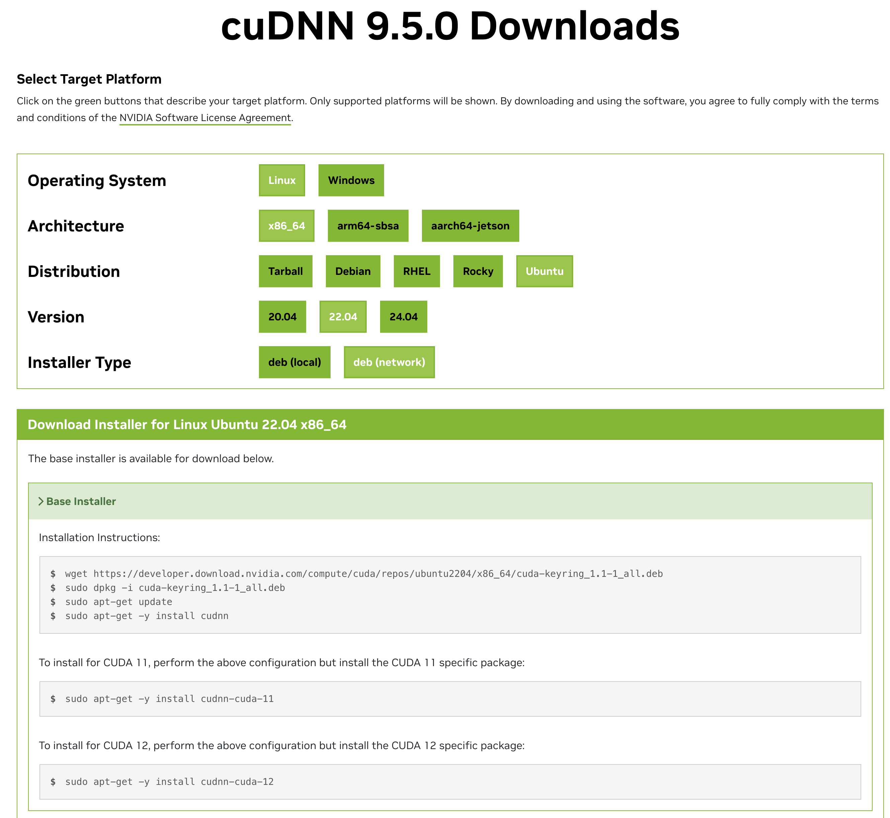
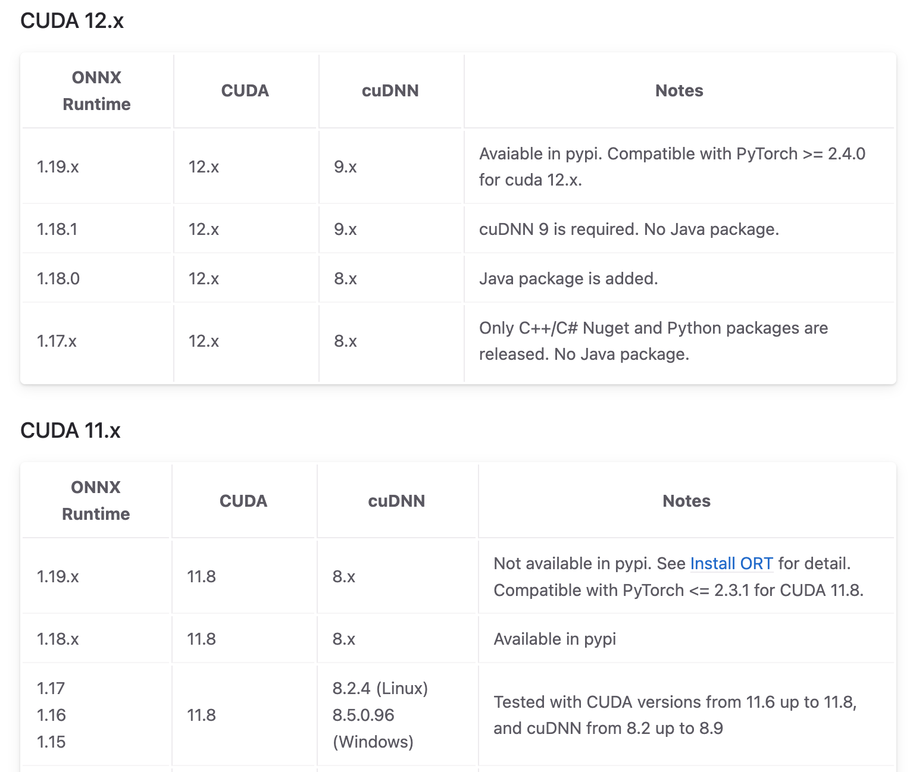
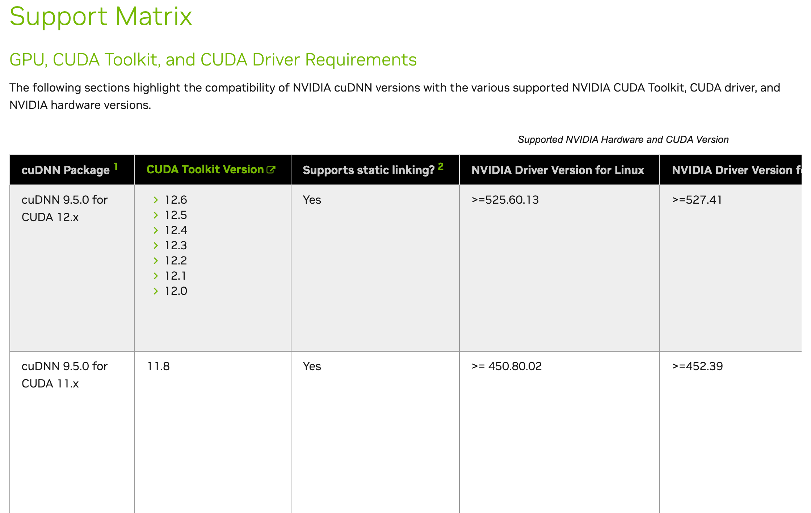
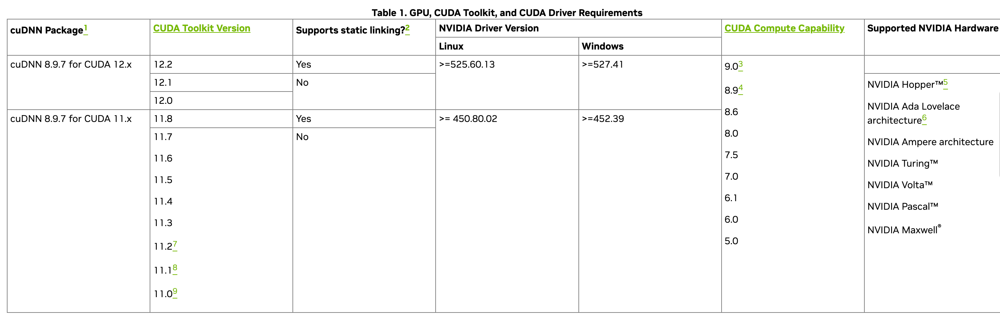

# My-FunASR

基于[FunASR](https://github.com/modelscope/FunASR/tree/main)实现语音识别，功能包括语音识别（ASR）、语音端点检测（VAD）、标点恢复。

- [My-FunASR](#my-funasr)
  - [查看CUDA版本:](#查看cuda版本)
  - [安装CUDA:](#安装cuda)
  - [配置CUDA环境变量:](#配置cuda环境变量)
    - [查看CUDA目录信息:](#查看cuda目录信息)
    - [解决步骤:](#解决步骤)
      - [1. 检查 `nvcc` 是否存在于 `/usr/local/cuda-12.4/bin/` 中:](#1-检查-nvcc-是否存在于-usrlocalcuda-124bin-中)
      - [2. 设置 `PATH` 环境变量:](#2-设置-path-环境变量)
      - [3. 验证环境变量设置:](#3-验证环境变量设置)
      - [4. 再次尝试运行 `nvcc -V`:](#4-再次尝试运行-nvcc--v)
      - [5. 手动创建符号链接（可选）:](#5-手动创建符号链接可选)
      - [6. 重启终端或系统（可选）:](#6-重启终端或系统可选)
  - [查看cuDNN版本:](#查看cudnn版本)
    - [方法一:](#方法一)
    - [方法二:](#方法二)
    - [方法三:](#方法三)
  - [安装cuDNN:](#安装cudnn)
  - [创建虚拟环境:](#创建虚拟环境)
  - [安装依赖:](#安装依赖)
    - [安装funasr的依赖:](#安装funasr的依赖)
    - [安装torch环境(vllm会自动帮忙安装torch环境):](#安装torch环境vllm会自动帮忙安装torch环境)
    - [安装音频处理辅助库:](#安装音频处理辅助库)
    - [安装onnxruntime-gpu:](#安装onnxruntime-gpu)
    - [安装其他基础依赖:](#安装其他基础依赖)
  - [运行主程序:](#运行主程序)
    - [onnx版本模型(推荐，速度快):](#onnx版本模型推荐速度快)
    - [常规版本模型:](#常规版本模型)
  - [运行测试脚本:](#运行测试脚本)
    - [单文件测试:](#单文件测试)
    - [批量测试:](#批量测试)
  - [附录: CUDA Toolkit 与 cuDNN 匹配性检查](#附录-cuda-toolkit-与-cudnn-匹配性检查)
  - [鸣谢:](#鸣谢)

笔者以租用的ubuntu 22.04 4090(24G)显卡为例，讲下程序运行方式。

## 查看CUDA版本:

```log
(base) root@ubuntu22:~# nvidia-smi
Fri Oct 11 14:06:48 2024       
+-----------------------------------------------------------------------------------------+
| NVIDIA-SMI 550.78                 Driver Version: 550.78         CUDA Version: 12.4     |
|-----------------------------------------+------------------------+----------------------+
| GPU  Name                 Persistence-M | Bus-Id          Disp.A | Volatile Uncorr. ECC |
| Fan  Temp   Perf          Pwr:Usage/Cap |           Memory-Usage | GPU-Util  Compute M. |
|                                         |                        |               MIG M. |
|=========================================+========================+======================|
|   0  NVIDIA GeForce RTX 4090        Off |   00000000:00:08.0 Off |                  Off |
|  0%   26C    P8             11W /  450W |      12MiB /  24564MiB |      0%      Default |
|                                         |                        |                  N/A |
+-----------------------------------------+------------------------+----------------------+
                                                                                         
+-----------------------------------------------------------------------------------------+
| Processes:                                                                              |
|  GPU   GI   CI        PID   Type   Process name                              GPU Memory |
|        ID   ID                                                               Usage      |
|=========================================================================================|
|    0   N/A  N/A       742      G   /usr/lib/xorg/Xorg                              4MiB |
+-----------------------------------------------------------------------------------------+
(base) root@ubuntu22:~# nvcc -V
找不到命令 “nvcc”，但可以通过以下软件包安装它：
apt install nvidia-cuda-toolkit
```


## 安装CUDA:

```bash
wget https://developer.download.nvidia.com/compute/cuda/repos/ubuntu2204/x86_64/cuda-keyring_1.1-1_all.deb
sudo dpkg -i cuda-keyring_1.1-1_all.deb
sudo apt-get update
sudo apt-get -y install cuda-toolkit-12-4
# 如果要安装cuda 11.8 可使用下列指令，前面的指令通用。
# sudo apt-get -y install cuda-toolkit-11-8
```

如果在`sudo apt-get update`时，提示:

```log
W: 无法下载 https://download.docker.com/linux/ubuntu/dists/jammy/InRelease  Could not handshake: Error in the pull function. [IP: 18.172.31.22 443]
W: 部分索引文件下载失败。如果忽略它们，那将转而使用旧的索引文件。
```

这说明无法连接到docker官网，这是网络问题，可以通过添加Docker清华源解决。步骤如下:

添加 Docker 官方 GPG 密钥(清华源):

> 提示 "是否覆盖？(y/N)" 时输入 y。

```bash
curl -fsSL https://mirrors.tuna.tsinghua.edu.cn/docker-ce/linux/ubuntu/gpg | sudo gpg --dearmor -o /usr/share/keyrings/docker-archive-keyring.gpg
```

添加 Docker 官方仓库(清华源):

```bash
echo "deb [arch=amd64 signed-by=/usr/share/keyrings/docker-archive-keyring.gpg] https://download.docker.com/linux/ubuntu $(lsb_release -cs) stable" | sudo tee /etc/apt/sources.list.d/docker.list > /dev/null
```

此时再次运行`sudo apt-get update`，然后运行之后的指令即可。


## 配置CUDA环境变量:

如果你运行 `sudo apt-get -y install cuda-toolkit-12-4` 后没有报错，但 `nvcc -V` 还是不显示信息。例如:

```log
(base) root@ubuntu22:~# nvcc -V
找不到命令 “nvcc”，但可以通过以下软件包安装它：
apt install nvidia-cuda-toolkit
(base) root@ubuntu22:~# 
```

这是因为 CUDA 工具链未正确添加到你的环境变量中。

### 查看CUDA目录信息:

```bash
ls -l /usr/local/cuda
```

终端输出:

```log
(base) root@ubuntu22:~# ls -l /usr/local/cuda
lrwxrwxrwx 1 root root 22 10月 11 14:35 /usr/local/cuda -> /etc/alternatives/cuda
(base) root@ubuntu22:~# ls -l /etc/alternatives/cuda
lrwxrwxrwx 1 root root 20 10月 11 14:35 /etc/alternatives/cuda -> /usr/local/cuda-12.4
```

因为笔者第一层信息为符号连接，故笔者查看了更底层的目录信息。具体来说，上述信息反映:

1. `/usr/local/cuda` 是一个符号链接，指向 `/etc/alternatives/cuda`。
2. `/etc/alternatives/cuda` 也指向 `/usr/local/cuda-12.4`，这表示您的 `cuda` 符号链接配置是正确的。

通常这种设置应该可以正常使用 `nvcc`，但如果仍然无法找到 `nvcc`，可能是因为环境变量 `PATH` 和 `LD_LIBRARY_PATH` 没有正确配置。

### 解决步骤:

请按照以下步骤确保环境变量正确配置，并检查是否可以找到 `nvcc`：

#### 1. 检查 `nvcc` 是否存在于 `/usr/local/cuda-12.4/bin/` 中:

运行以下命令检查 `nvcc` 文件是否存在：

```bash
ls /usr/local/cuda-12.4/bin/nvcc
```

如果文件存在，请继续下一步。如果不存在，说明安装不完整，可能需要重新安装 CUDA 工具链。

终端输出:

```log
(base) root@ubuntu22:~# ls /usr/local/cuda-12.4/bin/nvcc
/usr/local/cuda-12.4/bin/nvcc
(base) root@ubuntu22:~# 
```

#### 2. 设置 `PATH` 环境变量:

确保 `nvcc` 所在的目录被添加到 `PATH` 环境变量中。终端执行以下命令添加环境变量:

```bash
echo 'export PATH=/usr/local/cuda-12.4/bin:$PATH' >> ~/.bashrc
echo 'export LD_LIBRARY_PATH=/usr/local/cuda-12.4/lib64:$LD_LIBRARY_PATH' >> ~/.bashrc
```

然后激活更新后的 `.bashrc` 配置文件:

```bash
source ~/.bashrc
```

#### 3. 验证环境变量设置:

运行以下命令确认 `nvcc` 的路径是否已添加到 `PATH` 中：

```bash
echo $PATH
```

输出中应包含 `/usr/local/cuda-12.4/bin`，例如：

```
/usr/local/cuda-12.4/bin:/usr/local/sbin:/usr/local/bin:/usr/sbin:/usr/bin:/sbin:/bin
```

#### 4. 再次尝试运行 `nvcc -V`:

尝试运行以下命令检查 `nvcc` 版本：

```bash
nvcc -V
```

终端输出:

```bash
(base) root@ubuntu22:~# nvcc -V
nvcc: NVIDIA (R) Cuda compiler driver
Copyright (c) 2005-2024 NVIDIA Corporation
Built on Thu_Mar_28_02:18:24_PDT_2024
Cuda compilation tools, release 12.4, V12.4.131
Build cuda_12.4.r12.4/compiler.34097967_0
(base) root@ubuntu22:~# 

```

查找 `nvcc` 命令所在路径:

```bash
which nvcc
```

终端输出:

```log
(base) root@ubuntu22:~# which nvcc 
/usr/local/cuda-12.4/bin/nvcc
(base) root@ubuntu22:~# 
```

一切正常，说明 nvidia-cuda-toolkit 正确安装。

#### 5. 手动创建符号链接（可选）:

如果以上步骤仍然无法解决问题，可以手动创建 `nvcc` 的符号链接：

```bash
sudo ln -sf /usr/local/cuda-12.4/bin/nvcc /usr/bin/nvcc
```

#### 6. 重启终端或系统（可选）:

如果完成以上步骤后依旧无法使用 `nvcc`，可以尝试重启终端或系统，确保所有环境变量和配置生效。


## 查看cuDNN版本:

你可以以下方法任选其一，来检查 cuDNN 的版本和状态。

### 方法一:

```bash
dpkg -l | grep cudnn
```

终端输出:

```log
(base) root@ubuntu22:~# dpkg -l | grep cudnn
ii  cudnn9-cuda-12                             9.5.0.50-1                              amd64        NVIDIA cuDNN for CUDA 12
ii  cudnn9-cuda-12-6                           9.5.0.50-1                              amd64        NVIDIA cuDNN for CUDA 12.6
ii  libcudnn9-cuda-12                          9.5.0.50-1                              amd64        cuDNN runtime libraries for CUDA 12.6
ii  libcudnn9-dev-cuda-12                      9.5.0.50-1                              amd64        cuDNN development headers and symlinks for CUDA 12.6
ii  libcudnn9-static-cuda-12                   9.5.0.50-1                              amd64        cuDNN static libraries for CUDA 12.6
(base) root@ubuntu22:~# 
```

### 方法二:

终端输入下列指令查看系统级是否有cuDNN:

```bash
cat /usr/local/cuda/include/cudnn_version.h | grep CUDNN_MAJOR -A 2
```

可能显示 `没有那个文件或目录` ，不要急，有可能你的 cuDNN 是系统级安装的，并非安装在 CUDA 目录下。可以通过下列指令再试试:

```bash
cat /usr/include/cudnn_version.h | grep CUDNN_MAJOR -A 2
```

终端输出:

```log
#define CUDNN_MAJOR 9
#define CUDNN_MINOR 5
#define CUDNN_PATCHLEVEL 0
--
#define CUDNN_VERSION (CUDNN_MAJOR * 10000 + CUDNN_MINOR * 100 + CUDNN_PATCHLEVEL)

/* cannot use constexpr here since this is a C-only file */
```

该信息表示 cuDNN 的版本为 9.5.0。

### 方法三:

使用以下命令检查 `libcudnn` 文件在系统中的实际位置：

```bash
find / -name "libcudnn*"
```

终端输出类似(主关注 `.so` 文件即可):

```log
(base) root@ubuntu22:~# find / -name "libcudnn*"
/root/anaconda3/pkgs/pytorch-2.2.2-py3.11_cuda12.1_cudnn8.9.2_0/lib/python3.11/site-packages/torch/lib/libcudnn.so.8
/root/anaconda3/pkgs/pytorch-2.2.2-py3.11_cuda12.1_cudnn8.9.2_0/lib/python3.11/site-packages/torch/lib/libcudnn_ops_train.so.8
/root/anaconda3/pkgs/pytorch-2.2.2-py3.11_cuda12.1_cudnn8.9.2_0/lib/python3.11/site-packages/torch/lib/libcudnn_ops_infer.so.8
/usr/lib/x86_64-linux-gnu/libcudnn.so.9.5.0
/usr/lib/x86_64-linux-gnu/libcudnn_graph.so.9.5.0
/usr/lib/x86_64-linux-gnu/libcudnn_heuristic.so.9.5.0
/usr/lib/x86_64-linux-gnu/libcudnn_ops.so.9.5.0
/usr/lib/x86_64-linux-gnu/libcudnn.so.9
```

上述信息说明安装了多个 cuDNN 版本:

- usr/lib/x86_64-linux-gnu/libcudnn.so.9.5.0: cuDNN 9.5.0 具体版本
- /root/anaconda3/pkgs/pytorch-2.2.2-py3.11_cuda12.1_cudnn8.9.2_0/lib/python3.11/site-packages/torch/lib/libcudnn.so.8: Anaconda 环境(base)中安装的 PyTorch 是与 CUDA 12.1 和 cuDNN 8.9.2 版本匹配的。

`/root/anaconda3/` 为首的 `.so` 文件不需要关心，这类 Anaconda 环境(例如base)内部安装的cuDNN，如果创建一个新环境会自动索引系统的cuDNN。

拓展: 如果你激活 Anaconda 环境(base)，可以使用以下命令查看 cuDNN 版本:

```bash
python -c "import torch; print(torch.backends.cudnn.version())"
```

笔者终端输出:

```log
(base) root@ubuntu22:~# python -c "import torch; print(torch.backends.cudnn.version())"
8902
(base) root@ubuntu22:~# 
```


## 安装cuDNN:

可以在cuDNN官方配置个人系统生成安装指令，例如:



```bash
wget https://developer.download.nvidia.com/compute/cuda/repos/ubuntu2204/x86_64/cuda-keyring_1.1-1_all.deb
sudo dpkg -i cuda-keyring_1.1-1_all.deb
sudo apt-get update
sudo apt-get -y install cudnn
```

To install for CUDA 11, perform the above configuration but install the CUDA 11 specific package:

```bash
sudo apt-get -y install cudnn-cuda-11
```

To install for CUDA 12, perform the above configuration but install the CUDA 12 specific package:

```bash
sudo apt-get -y install cudnn-cuda-12
```

现在你应该已经成功安装了cuDNN(**上述指令会自动配置环境变量**)，可以通过以下指令查看下效果:

```bash
dpkg -l | grep cudnn
```

## 创建虚拟环境:

```bash
conda create -n funasr_onnx python=3.10
conda activate funasr_onnx
```

## 安装依赖:

### 安装funasr的依赖:

```bash
# 笔者安装的funasr版本为1.1.11
pip install -U funasr
# 笔者安装的funasr-onnx版本为0.4.1
pip install -U funasr-onnx
pip3 install -U modelscope
```

### 安装torch环境(vllm会自动帮忙安装torch环境):

```bash
# 适配CUDA版本>=12.1，如果你是 CUDA 11.x 请查看官网安装方式，笔者安装的 vllm 版本为 0.6.2
pip install vllm
# vllm安装torch组建时不包括torchaudio，需要自行安装下，注意确定版本匹配。
pip install torchaudio==2.4.0
# 笔者安装的 vllm-flash-attn 版本为 2.6.2
pip install vllm-flash-attn
```

### 安装音频处理辅助库:

```
apt install ffmpeg
```

可通过 `ffmpeg -version` 查看安装的 ffmpeg 版本，笔者的 ffmpeg 版本为 `ffmpeg version 4.4.2-0ubuntu0.22.04.1`。

### 安装onnxruntime-gpu:

```bash
pip install onnxruntime-gpu
```

该指令会自动安装 `onnx onnxruntime onnxruntime-gpu` ，笔者安装的版本为:

```log
onnx                              1.17.0
onnxruntime                       1.19.2
onnxruntime-gpu                   1.19.2
```

你可能需要安装与自己电脑cuda匹配的onnx版本，请查看[onnx官网](https://onnxruntime.ai/docs/execution-providers/CUDA-ExecutionProvider.html#install)。



例如 ubuntu 22.04、cuDNN 8.9.7、CUDA Toolkit 11.8:

```bash
pip install onnxruntime-gpu==1.16
```

⚠️如果运行代码后，终端出现下列内容，说明 onnxruntime-gpu 没有正常启用:

```log
RuntimeWarning: CUDAExecutionProvider is not avaiable for current env, the inference part is automatically shifted to be executed under CPUExecutionProvider.
```

这种情况下，你需要多次测试自己的电脑适配哪个版本的 `onnxruntime-gpu`，你可能会用到卸载指令:

```bash
pip uninstall onnx onnxruntime onnxruntime-gpu
```

### 安装其他基础依赖:

```bash
pip install loguru pydub python-multipart
```


## 运行主程序:

### onnx版本模型(推荐，速度快):

```bash
python main_onnx.py
```

### 常规版本模型:

```bash
python main.py
```


## 运行测试脚本:

注意⚠️: 第一次运行文件耗时会较大，多试几次让模型稳定再批量测试。

### 单文件测试:

```bash
python openapi/simple_asr_test.py
```

### 批量测试:

```bash
python openapi/simple_asr_test_average.py
```


## 附录: CUDA Toolkit 与 cuDNN 匹配性检查

注意⚠️: CUDNN 需要和 CUDA Toolkit 版本匹配才可以正常使用 onnxruntime-gpu。

最新版本 CUDA Toolkit 与 cuDNN [匹配矩阵](https://docs.nvidia.com/deeplearning/cudnn/latest/reference/support-matrix.html):



过往版本 CUDA Toolkit 与 cuDNN [匹配矩阵](https://docs.nvidia.com/deeplearning/cudnn/latest/reference/archives.html):


例如 cuDNN 8.9.7 和 CUDA Toolkit 的[匹配矩阵](https://docs.nvidia.com/deeplearning/cudnn/archives/cudnn-897/support-matrix/index.html):




## 鸣谢:

感谢 [FunASR](https://github.com/modelscope/FunASR/tree/main) 团队的贡献，才能让语音识别这么方便。

🚨注意: 如果大家想要了解 FunASR 的使用，请以 FunASR 的 GitHub 为准，Model Scope 不为标准。